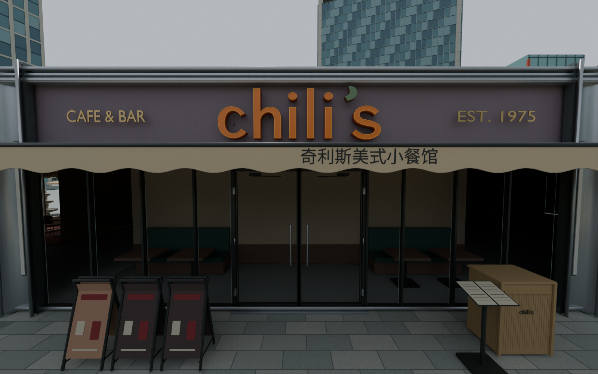

# 中关村大融城 · NBA 2K26 球场工程

本分支当前内容是 **ZGC R13 工程交接**：可编辑模型、当前唯一游戏 IFF、照片与用户附件、原始制作指南、构建工具、必要技术底包、当前网页预览及检查记录。此前旧场地工程从本分支当前文件树移除，历史提交仍可回查。

目标模式为 **Blacktop**，游戏只安装 [`arena_700_int.iff`](nba2k-arena/zgc-court/output/arena_700_int.iff)。其它底包只用于制作，不能全拖进游戏。

## 阅读入口

1. [开始使用](START_HERE.md)：取得完整大文件、配置路径、启动预览、安装方式。
2. [完整交接指南](nba2k-arena/zgc-court/TRANSFER_GUIDE.md)：用户要求、准确空间关系、版本事实、文件用途、真实构建流程、黑屏排查及防回归约束。
3. [逐文件用途清单](docs/FILE_CATALOG.csv)与[完整文件清单](docs/FILE_MANIFEST.json)：路径、大小、校验值及用途。
4. [制作依赖清单](nba2k-arena/BUILD_DEPENDENCIES.json)：四个必需底包及历史诊断材料，保持相对位置。
5. [用户聊天附件索引](nba2k-arena/zgc-court/references/user-attachments/INDEX.json)：17 张明确发来的截图和最初任务书。实拍照片、原始 ZIP、草稿中 Word/PDF 指南另在 `references/` 对应目录。

## 当前状态

R13 精修 Chili’s 面向球场的主立面：非发光灯牌实体、金属与涂层、布雨棚、门窗五金、石材/水泥等；篮板更不透明、反光更柔和。保留矩形建筑、左转角喷泉露台、左右围栏差异、右侧替补席和黄黑半场换端。

当前 IFF 为 **1,685,622,410 字节**，SHA256 为 `9e9cd0f73b1c6c2baf6d9f45cb472ac110282e7d161c20ce9d373fd968532622`。

**R13 尚未进游戏确认。** 之前用户截图已显示场地可见，但回放篮板、半场方向、替补坐姿等须按对应版本判断。离线渲染、网页正常、CRC 或资源检查通过都不能替代实际游戏验证。历史全场黑屏没有被完整对照实验证明为单一原因。

此图使用临时检查光照，不是游戏截图；字形、隐藏结构和部分材质参数仍为据图近似。灯光制作尚未开始。

## 大文件与保留范围

IFF、Blender 源和 GLB 使用 Git LFS；克隆后执行 `git lfs pull`。只下载网页上的 ZIP 可能得到指针，不能据小文件大小判断模型损坏。参见 [GitHub 的 Git LFS 说明](https://docs.github.com/en/repositories/working-with-files/managing-large-files/about-git-large-file-storage)。

保留当前源、原图、原始指南、必要底包和验证证据；不上传旧交付包、本机预览缓存、服务控制令牌、登录凭据、安装好的运行时或其它无关 Mod。原始照片 ZIP 与解压图同时保留是来源留档，不是旧版本。

此交接不改变素材权利归属；第三方照片、技术底包和原指南仍按各自来源理解。后续 AI 应以用户最新要求为准，不能把参考文档、旧 README 或未验证建议当成新的操作授权。
