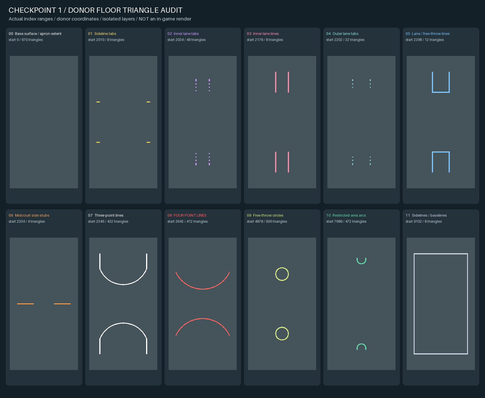
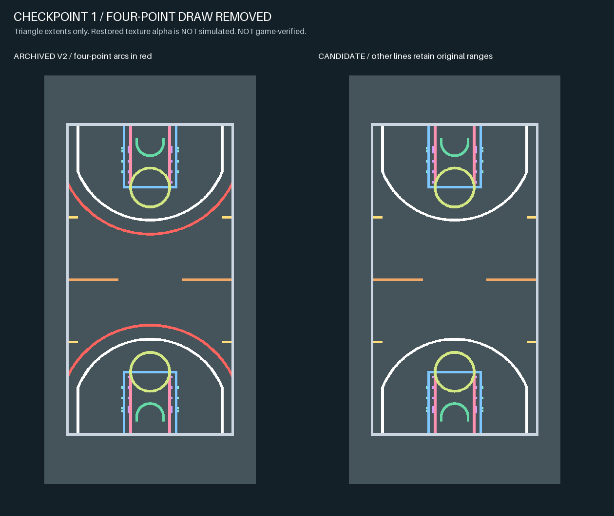

# Checkpoint 1：标线修正候选与可复现诊断

日期：2026-09-06。状态：**静态验证通过，待用户游戏实测，整体球场尚未完成。**

## 当前目标与范围

用户已明确目标为 NBA 2K 球场 MOD，外观是参考照片中的室外常规篮球场。允许调整屋顶、墙体、悬挂屏等装饰结构的可见性和照明；球场尺寸、篮筐、碰撞和玩法锚点仍受保护。

本检查点聚焦两个有直接证据的标线问题，并查清黑树诊断中的一个错误方向。尚未修改建筑、灯光、树木或游戏规则，也未完成常规中线／中圈。

后续常规标线以 [NBA 官方场地图](https://cms.nba.com/wp-content/uploads/sites/4/2025/10/2025-26-NBA-Officials-Guide.pdf) 和 [NBA 场地规则](https://official.nba.com/rule-no-1-court-dimensions-equipment/) 为参考，必须与 donor 玩法坐标对齐。本检查点不把 donor 整块地板包围盒当成比赛边界，不声称已达到正式场地尺寸规范。用户尚未说明实际游戏模式；可见标线改变不会自动改变计分判定。

## 候选文件

使用同一目录内的这两个文件：

| 文件 | SHA-256 |
| --- | --- |
| [`arena_700_int.iff`](../../output/checkpoint1/line_fix/arena_700_int.iff) | `4a26e97e332a91799dc6083e680d46202aed6a7f3b86f2426f9bbf187b72f6f0` |
| [`arena_700_int_floor.iff`](../../output/checkpoint1/line_fix/arena_700_int_floor.iff) | `5f23522f783614d1572dca4f904132659f0d9ad4bd266b8148cbaacd333cf2ce` |

配套 floor 与 V2 逐字节一致，仍用于覆盖 700 槽独立地板场景；该覆盖是否在用户游戏里生效尚待确认。详细机器校验见 [`validation.json`](../../output/checkpoint1/line_fix/validation.json)。

## 实际改动

1. **关闭四分线绘制段。** 从 floor 的 Prim 列表移除 `line_four_point_lowShape`，其原索引区间为 `[3642, 4878)`、412 个三角形。保留原顶点／索引缓冲区以及其他标线。删除前先补全所有继承的 `Start`、`Material`、`Type`，保证后续罚球圈仍从 4878 开始，冲撞区仍从 7686 开始，不会发生错位。
2. **恢复两种标线材质的 donor `DetailAlbedoTexture` 引用。** 原资源的 RGB 为白色、alpha 有变化；V2 替换成完全不透明的 4×4 BC1 色块，丢失了原透明遮罩信息。保留 V2 其余材质参数，只恢复这两个纹理槽。详见 [透明遮罩核查](line_mask_findings.md)。

原标线纹理 `floor_line.71af6dc754935e49.tld` 的像素数据没有包含在交接包中。候选保留原 SCNE 的完整纹理记录，让游戏解析既有共享资源；本地只能核验引用恢复正确，无法验证原遮罩图案和游戏中的可见线宽。若游戏中标线消失或异常，应先核对该共享资源的实际加载，不要再换成不透明纯白贴图掩盖问题。

## 保护范围与验证

已运行 18 项回归／集成测试，包含真实 donor floor、无 Start 的连续段、继承材质、非法索引、源数据不变和最终 IFF 资源对照。

- 原 donor、V2 主 IFF、V2 配套 floor、原顶点缓存哈希未变。
- 最终主 IFF 与 V2 保持相同条目和顺序，CRC 检查通过；原条目中只有 `level.SCNE` 变化。
- 将 floor Prim 列表及两个标线贴图槽还原后，整个主场景与 V2 完全相同。
- 保留全部 Object、篮筐、碰撞、灯光、shader、树、原顶点／索引资源。
- 生成器只使用项目内的归档文件与缓存，不读取游戏目录或网络，不调用 Oodle DLL，不运行旧安装脚本。

这些检查只能证明候选的变更范围和文件结构，不能证明游戏加载、计分、照明或视觉效果通过。

## 已查明的几何与黑树问题



上图直接使用原顶点／索引数据，显示的是绘制几何范围，不模拟透明贴图、光照或游戏画面。第 08 段确为独立四分线，第 06 段是中场两侧短线而不是完整中线／中圈。当前标准场外观还需后续处理。



黑树方面，已确认旧采样器实际采到的 10 个模型、1042 个样本都具有显式 Start，修正 Start 累积不会改变 V2 树的采样结果。因此不能把黑树归因于该解析隐患。最近面法线对应多个不同 packed frame、树 UV7 全零及缺少部分对象／模型元数据，是继续调查的线索，尚未确认因果关系。见 [完整黑树诊断](palm_audit.md)。

## 用户游戏测试

1. 使用你自己的游戏环境；本项目没有执行安装或回滚。先保留当前槽位文件备份。
2. 当前候选固定为 **700 槽**，主 IFF 与配套 floor 应使用本检查点目录中的一对，避免同槽其他 MOD 干扰。若实际使用其他槽位，先说明槽位，避免把“未加载本候选”误判为修改失败。
3. 优先提供与失败截图相近的全场机位，再补一张中场和边线近景。核对：四分弧是否消失、原标线是否变窄／边缘恢复、是否仍有多层标线。
4. 树仍黑、屋顶仍在、中线仍未贯通，均是本检查点明确尚未处理的事项。

只有确认加载了上述哈希的文件，才能把反馈归因于本次候选。我们需要确认这条 IFF 加载与标线渲染路径后，再推进下一组改动。

## 可复现命令

在仓库根目录，使用已有的 Python + NumPy 2.3.5 + Pillow 12.3.0 环境：

```sh
python3 nba2k-arena/scripts/checkpoint1_floor.py --audit --build
python3 -m unittest discover -s nba2k-arena/tests -v
python3 nba2k-arena/scripts/checkpoint1_floor.py --validate
python3 nba2k-arena/scripts/audit_palm_tangents.py --output-dir nba2k-arena/docs/checkpoint1
```

前两种生成命令会覆盖本检查点对应的图片／候选／报告，保留 donor 和 V1/V2。不要为复现本检查点运行历史 `reproduce_revision2.py --build`：该命令会重写旧 V2 文件和旧报告。

## 下一检查点

- 按测试结果确认标线原遮罩资源可用，再处理完整中线／中圈与常规标线布局；保持篮筐及比赛坐标不变。
- 单个已知 donor 对象与单棵树做受控对照，验证材质与光照输入；不猜测 packed tangent 格式或随机填对象元数据。
- 根据已获授权定位室内装饰，明确隐藏建筑、天空背景、光照／阴影与相机遮挡的配套关系，再输出独立的室外环境候选。

原始失败状态与历史证据保留在 [HANDOFF_ZH.md](../../handoff/HANDOFF_ZH.md)。
